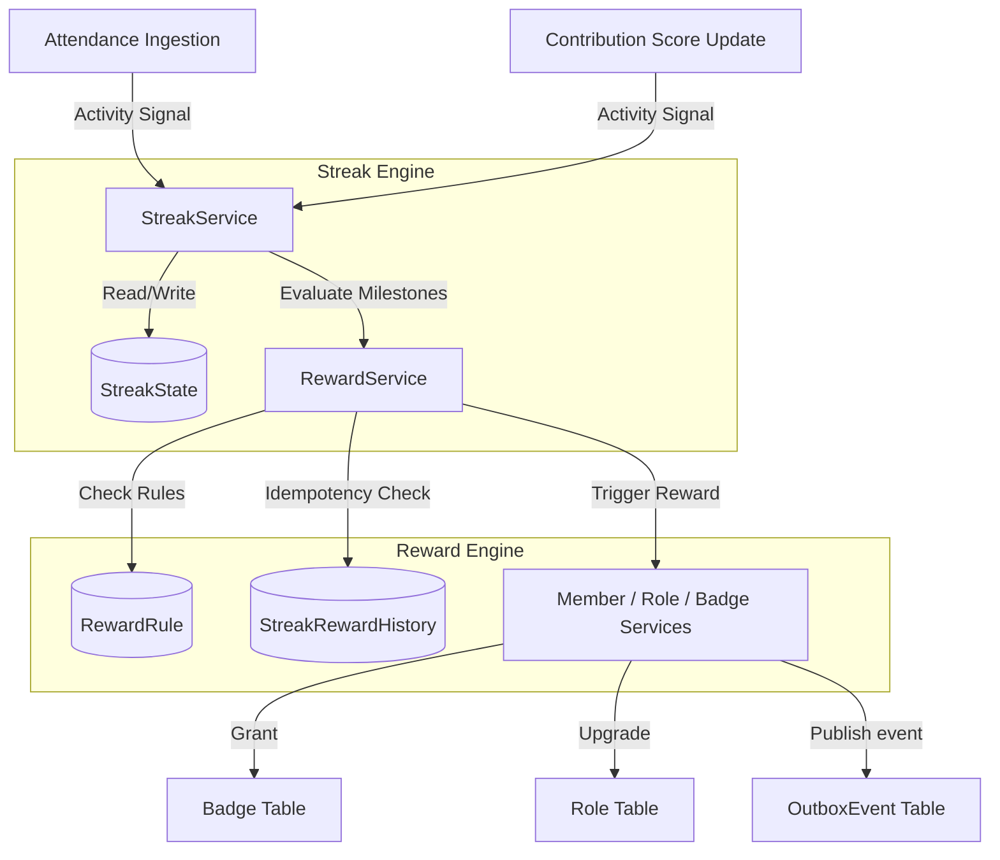

# Design Doc: Streaks & Rewards Subsystem

This document details the architecture and relationship between streaks, contribution scoring, and attendance ingestion.

## Overview

The Streaks and Rewards Subsystem drives user engagement by rewarding consistent activity. It works by collecting signals (such as attendance and contribution updates), calculating streaks (including grace periods), and automatically applying milestone rewards.

---

## Streak Calculation Logic

A daily activity streak is maintained with the following rules:
- **Same-day activities**: Multiple activities on the same calendar day (UTC) do not increment the streak but update the `lastActivityAt` timestamp.
- **Consecutive-day activities**: An activity on the next calendar day increments the streak (`currentStreak++`).
- **Grace Period (1-day miss)**:
  - If a user misses exactly 1 day (e.g. active on Day 1, inactive on Day 2, active on Day 3):
    - If `graceUsed` is `false`, the streak is preserved, and `graceUsed` is set to `true`.
    - If `graceUsed` is `true` (already used in the current streak), the streak breaks and resets to `1`.
- **Streak Break**: If the inactivity exceeds the grace period, the streak breaks and resets to `1`.

---

## Reward Rules & Idempotency

- **RewardRule**: Defines milestones (e.g. 7-day milestone, 30-day milestone) and the action type (`GRANT_BADGE` or `UPGRADE_ROLE`).
- **StreakRewardHistory**: Prevents duplicate distribution of rewards. Before awarding a milestone reward to a wallet, the system checks if the wallet has already received it under the given `ruleId`. If a match exists, the action is skipped.
- **Supported Reward Types**:
  - `GRANT_BADGE`: Inserts a `Badge` record (e.g., "7-Day Streak Warrior").
  - `UPGRADE_ROLE`: Upgrades the member's community role to a target role (e.g., "contributor" or "admin").
