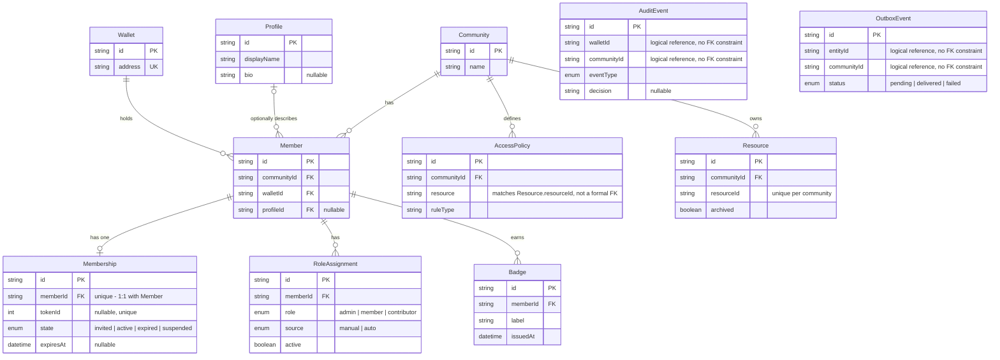

# Data Model

This document outlines the core Prisma models used in `apps/access-api` and how they connect to
one another. It expands on the high-level overview in the README's "Data Model" section:
`communities`, `wallets`, `members`, `memberships`, `roles`, `access policies`, `profiles`,
`badges`, `audit_events`, and `outbox_events`.

Source of truth: [`apps/access-api/prisma/schema.prisma`](../apps/access-api/prisma/schema.prisma).
If this document and the Prisma schema ever conflict, the schema takes precedence. Follow the steps 
under Updating the Diagram to sync them up.

## Entity-relationship diagram



> **Note on `AccessPolicy`, `AuditEvent`, and `OutboxEvent`:** these models store `communityId`,
> `walletId`, and `resource` as plain string columns rather than Prisma `@relation` fields. This is
> intentional — audit and outbox records must remain readable even if the community, wallet, or
> resource they describe is later deleted or renamed. They are drawn above without a hard
> connecting line to reflect that they are *logical*, not enforced, references.

## Tables

### `communities` (`Community`)
The tenant boundary for everything else in the schema. A community owns its members
(`Member.communityId`), its access rules (`AccessPolicy.communityId`), and the resources those
rules protect (`Resource.communityId`). Almost every other table either belongs to a community
directly or scopes its data by `communityId`, so this is the natural starting point when reading
the schema.

### `wallets` (`Wallet`)
Represents an on-chain address (`address`, unique). A wallet can join multiple communities, and
each join produces a separate `Member` row — so `Wallet` and `Member` are one-to-many, not
one-to-one. `Wallet` also anchors the wallet-linking feature (`LinkedWallet`, `Challenge`), which
lets a user prove control of a secondary address without it becoming a separate membership
identity.

### `members` (`Member`)
The join point between a `Wallet` and a `Community` (`@@unique([communityId, walletId])`), so a
wallet has exactly one `Member` row per community. `Member` is the hub that almost everything else
hangs off of: it optionally links to a `Profile`, and it owns one `Membership`, any number of
`RoleAssignment`s, and any number of `Badge`s.

### `memberships` (`Membership`)
The lifecycle state of a single membership: `invited`, `active`, `expired`, or `suspended`
(`MembershipState`), plus `expiresAt`/`renewedAt` timestamps and the on-chain `tokenId` (from the
`MembershipNFT` contract) when one exists. It has a strict one-to-one relationship with `Member`
(`memberId` is `@unique`), so membership state is tracked separately from the member record itself
rather than as inline columns on `Member`.

### `roles` (`RoleAssignment`)
Grants a `Role` (`admin`, `member`, `contributor`) to a `Member`, tagged with a `source` (`manual`
or `auto` — for example, an `active` membership automatically granting the `member` role) and an
`active` flag so a role can be revoked without deleting history. A member can hold several active
role assignments at once; the policy engine reads all of them when evaluating access.

### `access policies` (`AccessPolicy`)
Defines the rule (`ruleType`, e.g. `PUBLIC`, `MEMBERS_ONLY`, `ADMINS_ONLY`) that governs a given
`resource` string within a `Community`, with an optional `params` JSON blob for rule-specific
configuration. Uniquely keyed on `(communityId, resource)`, so a community can have at most one
active policy per resource. The `resource` field matches the `resourceId` used on `Resource`
records but is stored as plain text rather than a foreign key.

### `profiles` (`Profile`)
Optional, reusable display information (`displayName`, `bio`) that a `Member` can point to via
`profileId`. It is intentionally decoupled from `Wallet` and `Member` so the same profile could, in
principle, be reused, and so profile data can be edited without touching membership or role state.

### `badges` (`Badge`)
A simple, append-only achievement record (`label`, `issuedAt`) attached to a `Member`. Badges are
the manual counterpart to the (currently deferred) reward-rule system — `RewardRule` and
`StreakRewardHistory` describe how badges could eventually be granted automatically based on
activity streaks.

### `audit_events` (`AuditEvent`)
An append-only, hash-chained log (`recordHash` / `previousRecordHash`) of access decisions and
state changes, typed by `EventType` (`ACCESS_CHECK`, `MEMBERSHIP_CREATED`, `POLICY_EVALUATION`,
etc.). It captures `beforeState`/`afterState` snapshots and, when the event originated on-chain,
the `chainId`/`txHash`/`blockNumber` that produced it. `walletId` and `communityId` are stored as
plain strings (not relations) so the audit trail survives even if the referenced wallet or
community is later removed.

### `outbox_events` (`OutboxEvent`)
The transactional outbox: every mutation that should notify external systems writes an
`OutboxEvent` in the same transaction as the state change, with a `status` of `pending`,
`delivered`, or `failed`, and retry bookkeeping (`retryCount`, `nextRetryAt`, `claimedBy`). See the
README's [Integration Event Outbox](../README.md#integration-event-outbox) section for the full
delivery contract. Like `AuditEvent`, its `communityId`/`entityId` fields are logical references
rather than enforced foreign keys, and permanently failed events are moved to `DeadLetterEvent`
for manual inspection.

## Regenerating this diagram

The Mermaid block above is hand-maintained to stay scoped to the tables described in this doc. To
generate a diagram (or markdown file) covering the *entire* current schema — including supporting
models like `Resource`, `GovernanceRule`, `WebhookSubscription`, `Appeal`, etc. — use
[`prisma-erd-generator-markdown`](https://github.com/w3cj/prisma-erd-generator-markdown):

```bash
# from apps/access-api
npm i -D prisma-erd-generator-markdown
```

Add a generator block to `apps/access-api/prisma/schema.prisma`:

```prisma
generator erdMarkdown {
  provider = "prisma-erd-generator-markdown"
  output   = "../../../docs/erd-full.md"
}
```

Then run:

```bash
npm run -w access-api prisma:generate
```

Running this outputs the complete ERD to docs/erd-full.md. If any schema updates touch the models 
listed here, just remember to keep this document's diagram and prose in sync.
